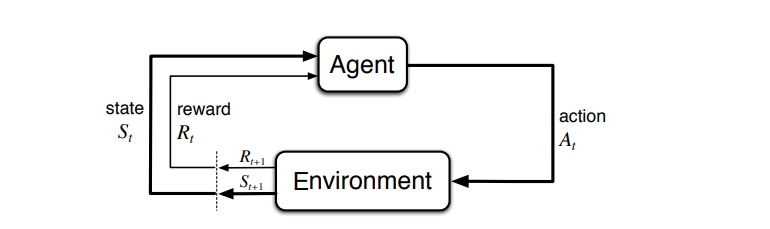

# Reinforcement Learning 101 Workshop

## Introduction 

In a simple RL problem, you have an _agent_ that performs actions
within an _environment_. The agent's action affect the environment
and vice versa.

## Markov Decision Process

Intuitively, a MDP can be thought of as a state machine that has
the following properties
  * each transition from state _S1_ to another state _S2_ is associated 
    with a probability
  * what happens at state _Sn_ is _independent_ of the past. This is known as the
_Markov property_.
    
More formally, the Markov property states that 
_P(St+1 | St) 
= P(St+1 | S1, S2, ..., St)_ 
i.e. the probability of transitioning from _St_ to _St+1_ is
independent of how the system reached _St_.

## Rewards

The agent receives a _reward_ (or _return_ ) for each action it performs at each state. In RL 
the goal is to maximixe the _total sum of returns_. For example, if the agent is at _t_ steps, we have
state _t_, we can have

_Gt = rt+1 + rt+2 + ... + rT_

### Non-terminating Processes and Discount
    
TBD

## Markov Reward Process

_Rs = E(Rt+1 | St)_

_R_ is the reward we get from state _S_ defined as the 
expected value of the next reward given that we are at _S_.
 
A MRP is a tuple _(S, P, R, &gamma;)_ where
* S is the set of states
* P is the probabiliy matrix of all _p(s' | s)_
* R is the reward function 
* &gamma; is a discount factor (more on this later.)

## Policy Function and Value Function

The unfortunately-called _Value_ function, expresses 
how good it is to be in a state. But how do we know that
a state is good? A state is good if from there we are
more likely to take actions that lead to maximizing _G_.
The _Policy_ function tells us that.

A policy function &pi; is a probability distribution for 
each action from a given state. That is, 
it tells us the probability that the
agent will take action _a_ from state _s_.

_&pi; (a | s) = **P**(At = a, | St = s)_

## Bellman Equation

Assuming we have the policy &pi;, the reward function, and the 
probability matrix, and the discount factor. 
We can calculate the value of each state with the _Bellman_
equation

_v(s) = **E**(Rt+1 + &gamma; &#8231; v &#8231;(St+1) | St = s)_

## Q-Learning

## Grid example with DP

## Grid example with Montecarlo

