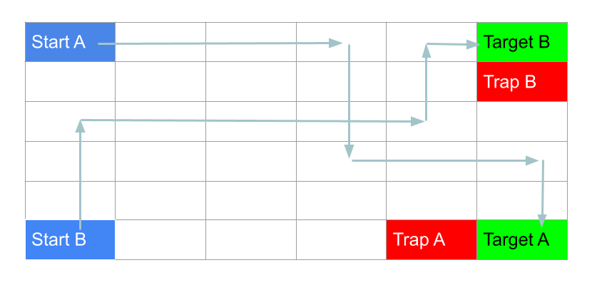
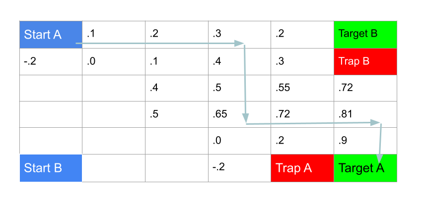

# Value-based Policy Example

## Overview 

The environment is a simple 6x6 grid.
Two agent traverse it to reach their targets withouth falling into a trap.

The _value based_ approach, we compute a _policy_ which consists of
what action should be taken at each state (or more generally a probability 
distribution among the possible action.) This policy is then refined
until it is deemed optimal.
The agent will then follow the path that maximixes the value at each step.

This is a very simple method impractical for most real applications since
it requires that we enumerate the states.

## Algorithm outline

Initially, a random policy is assigned (can be all zeros.)
Then, the policy is iteratively _evaluated_ (i.e. a value is given
to each state based on the expected reward) and _improved_ (i.e.)
alternative actions are tried to find out if the values can be
improved) until a fix point at which the values will not increase.
That is the optimal policy.
